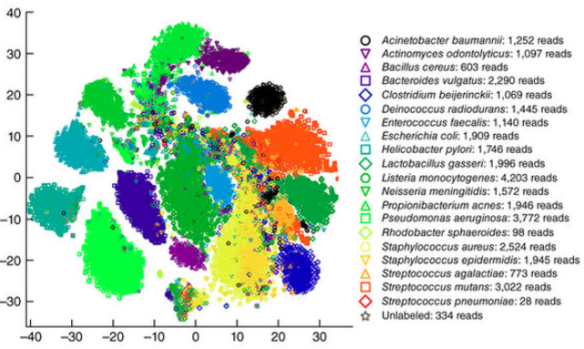
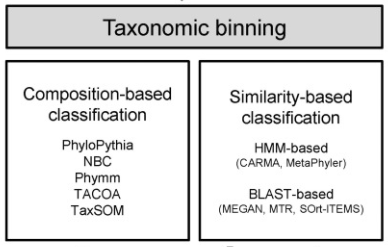
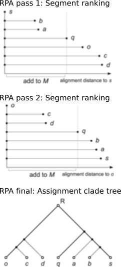
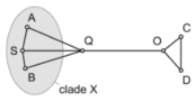
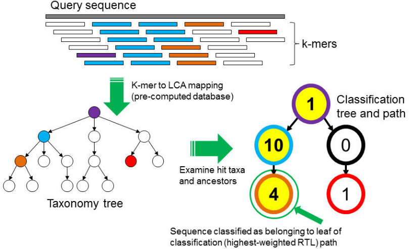

> **Binning**: grouping a dataset into subgroups which are distinct from one other

Which type of binning did we already do?

Important role in the analysis of metagenomes
- insight into the presence of novel genomes that are difficult to otherwise identify
- insight into the distinct numbers and types of taxa in the community
- way of reducing the complexity of the data

Binning algorithms: group contigs or scaffolds from the same or closely related organisms
- [Sangwan et al, 2016](https://microbiomejournal.biomedcentral.com/articles/10.1186/s40168-016-0154-5)
- Review of binning methods: [Mande et al, 2012](https://academic.oup.com/bib/article/13/6/669/193900/Classification-of-metagenomic-sequences-methods)
- [Sedlar et al, 2017](http://www.sciencedirect.com/science/article/pii/S2001037016300678)

**2 main elements**
- a metric to define the similarity between a given contig and a bin
- an algorithm to convert those similarities into assignments

")

2 strategies:
1. Classification into a taxonomic group through comparison to some referential data
2. Clustering into groups of sequences that represent taxonomic groups or genomes based on shared characteristics

2 possible outputs:
1. Taxonomic assignation
2. Input to assemble individual genomes

possible inputs
1. Raw reads
2. Contigs or scaffold

# Taxonomic binning

> **Taxonomic binning**: Grouping reads or contigs and assigning them to operational taxonomic units

 "Figure 1 from [Kim et al, 2013](https://www.researchgate.net/publication/257757057_Kim_M_Lee_KH_Yoon_SW_Kim_BS_Chun_J_Yi_H_Analytical_tools_and_databases_for_metagenomics_in_the_next-generation_sequencing_era_Genomics_Inform_11_102-113)")

## Similarity-based taxonomic binning

Similarity-based

1. Homology search for query sequence in reference collection using a nucleotide local alignment program
2. Program taxator splits the query into distinct segments and determines a taxon ID for each using the corresponding homologs
3. Program binner determines a taxon ID for the entire query based on the taxonomic assignments of the individual segments

### Local alignment (BLAST, Diamond or LAST)

- MEGAN ([Huson et al, 2011](http://genome.cshlp.org/content/21/9/1552.short))

    A sequence similarity approach that uses blast to compare metagenomic reads to a database of sequences that are annotated with NCBI taxonomy (Huson et al., 2011). It then infers the taxonomy of the sequence by placing the read on the node in the NCBI taxonomy tree that corresponds to the last common ancestor of all the taxa that contain a homolog of the read

- CARMA ([Gerlach & Stoye, 2011](https://academic.oup.com/nar/article-abstract/39/14/e91/1388198))

    Reciprocal best hits between database sequences and metagenomic reads and models gene-family specific rates of evolution to infer the appropriate taxonomic rank of each metagenomic read

- taxator-tk ([Dröge et al, 2015](https://academic.oup.com/bioinformatics/article/31/6/817/215163))

    ")

    taxator-tk can use BLASTN57 or LAST65 to search with the reads against a local reference database. Overlapping local alignments between the read and a number of reference sequences are joined to form longer segments. Each segment is assigned a taxon ID, and a consensus taxonomic assignment is derived by assigning a weight to each segment based on similarities to the reference sequence.

- DUDes ([Piro et al, 2016](https://academic.oup.com/bioinformatics/article/32/15/2272/1743640))

- GOTTCHA

    Aims at limiting the number of false positives in their predictions by only focusing on genomic regions that are unique to each reference. These regions are found using a combination of empirical data on coverage and machine learning approaches. GOTTCHA first trims the reads based on qualities followed by fragmentation to obtain a uniform read length. A read is split on every low quality base (Q < 20) and then divided into all non-overlapping 30-mers. Matching is done at the species level using exact matches with BWA

- SORT-Items (reciprocal BLAST approach to detect significant orthology) (Haque et al., 2009)
- MTR (a variation on Lowest Common Ancestor approaches that uses multiple taxonomic ranks) (Gori et al., 2011)
- ProViDE (analysis of alignment parameter thresholds, specifically customized for classifying viral sequences) (Ghosh et al., 2011)

$Q$: searched taxon

")

**Need to identify $A$, $B$, $S$, $O$ and $R$**

**Realignment placement algorithm (RPA)**

For Q:
- the closest evolutionary neighbors: A, B and S
- inaccurate to assign X to Q (A, B and S more closely related to each other than to Q)
- correct taxonomic assignment: parent of X and Q and outgroup --> $R$: lowest common ancestor (LCA) of these taxa and assign it to Q

Natural procedure to identify the segments corresponding to the leaf taxa within R among the homologs: Construction of a MSA for the segment and a phylogenetic tree --> too much computational effort

Algo: Identification of the reference segment that is most similar to q
- idea:
    - searches for the leaf node taxa of clade R among all segments based on a linear number of sequence comparisons between the input segments
    - Adds them to an empty working set M
- Pass 1
    - Alignment of all segments to s using fast nucleotide alignment and the edit distance
    - Addition to M of the taxa with equal or smaller distances than distance(s,q)
    - o: next most similar segment to s after q with distance(o,s) > distance(s,q)
- Pass 2
    - Alignment of all segments to o
    - Addition to M of all taxa with distances smaller than distance(o,q)
- Final
    - Use of the resulting set M of taxa to the taxon ID for q: LCA of these taxa

New representation: undirect graph with
- nodes: segments (tree leaves)
- edge: distances btw pairs of segments
- subgraph: monophyletic group in the species tree (X for example)

Lack of specificity of the LCA approaches

")

LCA: bottom-up method that solves ambiguities from high taxonomic levels

circle: LCA for its children nodes

DUD
- top-down
- more specific in higher taxonomic levels

### HMM-based or reference trees

- CARMA ([Krause et al, 2008](https://academic.oup.com/nar/article/36/7/2230/2409926))
    1. comparison of reads against protein sequences in PFAM db
    2. generation of a phylogenetic tree by comparing each read to the HMM(s) of the protein families having significant hit(s)
    3. inference of final taxonomy based on the placement of the read in the constructed phylogenetic tree

- Treephyler ([Screiber et al, 2010](https://academic.oup.com/bioinformatics/article/26/7/960/213843))

## Genome composition and taxonomic distances

)

Plot of 16S percent identity verses genus normalized Euclidean distance for tetranucleotide (A) and heptanucleotide (B) signatures. 

By plotting 16S identity verses Euclidean distance this plot demonstrates the range of oligonucleotide Euclidean distances useful for discerning the taxonomic relationships between sequences. Additionally, this plot shows that low oligonucleotide Euclidean distances are a strong indicator that sequences are from phylogenetically close organisms.

## Composition-based taxonomic binning

Approach
- Comparison of reads to sequences or models in a reference database using compositional properties

- Taxonomic assignation based on compositional similarity

 "Kraken, Figure 1 from [Wood & Salzberg, 2014](https://genomebiology.biomedcentral.com/articles/10.1186/gb-2014-15-3-r46)")

Kraken algorithm
- Extraction of k-mers $K(S)$ for a sequence $S$
- Mapping for each $k$-mer in $K(S)$ to LCA taxon of all genomes
- Creation of a classification tree
    - Pruned subtree used to classify $S$
    - Node weighted with the number of $k$-mers in $K(S)$ mapped to the taxon
- Extraction of a classification path
    - Scoring of each root-to-leaf (RTL): sum of all node weights along the path
    - Classification path: maximum scoring RTL path
- Assignation the label corresponding to classification path leaf to $S$ 

Idea:
- Consideration of each k-mer within a sequence as a separate piece of evidence
- Attempt to resolve any conflicting evidence if necessary

## Taxonomic binning

- k-mer alignment
    - Kraken ([Wood & Salzberg, 2014](https://genomebiology.biomedcentral.com/articles/10.1186/gb-2014-15-3-r46))
    - CLARK ([Ounit et al, 2015](https://bmcgenomics.biomedcentral.com/articles/10.1186/s12864-015-1419-2))
- Support Vector Machines
    - PhyloPithia ([McHardy et al, 2007](https://www.nature.com/articles/nmeth976))
    - PhylopithiaS ([Patil et al, 2011](https://www.nature.com/articles/nmeth0311-191))
- Naive-Bayesian approach
    - NBC ([Rosen et al, 2011](https://academic.oup.com/bioinformatics/article/27/1/127/202209))
    - FCP ([Parks et al, 2011](https://bmcbioinformatics.biomedcentral.com/articles/10.1186/1471-2105-12-328))
- kernelized-Nearest Neighbor (k-NN)
    - TACOA ([Diaz et al, 2009](https://bmcbioinformatics.biomedcentral.com/articles/10.1186/1471-2105-10-56))
- Interpolated Markov Models (IMMs)
    - Phymm and PhymmBL ([Brady & Salzberg, 2009](https://www.nature.com/articles/nmeth.1358))
    - SCIMM ([Kelley & Salzberg, 2009](https://bmcbioinformatics.biomedcentral.com/articles/10.1186/1471-2105-11-544))
- de Bruijn graphs and Markovian chain properties
    - ClaMS ([Pati et al, 2011](https://standardsingenomics.biomedcentral.com/articles/10.4056/sigs.2075298))
- Non-negative least squares (NNLS)
    - FOCUS ([Gueiros Z. Silva et al, 2014](https://peerj.com/articles/425/))
- Mixture modeling
    - Taxy ([Meinicke et al, 2011](https://academic.oup.com/bioinformatics/article/27/12/1618/258613))

- Alignment or pseudo-alignment
    - Kraken: (exploit LCA but speeds up the computation by substituting sequence mapping with k-mer matching.) Kraken classifies reads by breaking each into overlapping k-mers. Each k-mer is mapped to the lowest common ancestor of the genomes containing that k-mer in a precomputed database. For each read, a classification tree is found by pruning the taxonomy and only retaining taxa (including ancestors) associated with k-mers in that read. Each node is weighted by the number of k-mers mapped to the node, and the path from root to leaf with the highest sum of weights is used to classify the read.
    - CLARK: all the common k-mers between the targets in the database (e.g. a collection of all bacterial genomes) are removed. This gives a set of genomic regions that uniquely describes each target. A read is assigned to the target with which it shares the highest number of k-mers. In the most accurate mode, CLARK uses the full database of targets and assigns a confidence score to the assignment
    - LMAT: LMAT works by first generating a searchable database of k-mers from a large collection of genomes. For each k-mer, the lowest common ancestor in the taxonomy tree is calculated. A smaller “marker library” (kML) of the most informative k-mers is generated by separating k-mers into disjoint sets and discarding all sets with fewer than 1000 k-mers, and all k-mers where the lowest common ancestor is above the family level. When assigning taxonomy to a read, the information for each k-mer in the read is extracted from the library, and the path from the highest scoring node to its lowest common ancestor is created. This path is pruned by each conflicting assignment until the score drops below the threshold. Function is assigned in a similar fashion using a customized library.
    - SUPER-FOCUS: SUPER-FOCUS is a homology-based approach adopting a reduced SEED database to report the subsystems present in metagenomic samples and profile their abundances 
    - metaKallisto ([Schaeffer et al, 2017](https://academic.oup.com/bioinformatics/article/33/14/2082/3038398)): Pseudoalignment for metagenomic read assignment
- Support Vector Machines
    - PhyloPithia and PhylopithiaS (McHardy et al., 2007; Patil et al., 2011): support vector machines, which analyze training sequences associated with various phylogenetic groups to build oligonucleotide frequency models that determine whether a new sequence (e.g., a metagenomic read) is a member of the group
- Naive-Bayesian approach
    - NBC classifier: NBC, a naïve bayes classifier that has been shown to annotate more sequences than some sequence-similarity based procedures
    - FCP
- kernelized-Nearest Neighbor (k-NN)
    - TACOA
        - ratio between observed oligonucleotide frequencies and expected frequencies given the CG content
        - to cluster fragments, the k-NN approach is combined with the Gaussian kernel function. 
    - 1-NN
- Interpolated Markov Models (IMMs)
    - Phymm and PhymmBL: coupled with compositional interpolated Markov models
        - interpolated Markov models (Salzberg et al., 1998), which combine prediction probabilities derived from a variety of training sequence oligonucleotide lengths, and, optionally, blast search results, to classify metagenomics reads into phylogenetic lineages
    - Scimm
- signatures built using de Bruijn graphs and Markovian chain properties
    - ClaMS
- NNLs
    - FOCUS: FOCUS is an approach using NNLS to identify the organisms present in metagenomics samples and profile their abundances
- emergent self-organizing maps (ESOMs): cluster assembled metagenomic reads based on tetranucleotide frequency and, optionally, contig coverage and abundance distributions
    - partitioning contigs into groups that can be subsequently assembled into nearly complete genomes representing uncharacterized organisms
    - Two-tiered clustering (Saeed et al., 2012) is a related approach that first bins sequences into coarse groups based on GC content and the oligonucleotide frequency-derived error gradient (Saeed and Halgamuge, 2009), which assesses the variance in oligonucleotide frequency across the length of a read, and then subdivides these initial clusters based on tetranucleotide frequency
- Mixture modeling
    - Taxy

Limits
- Assumption that sequence characteristics being interrogated tend to be phylogenetically informative --> Variation in the taxonomic bias of these sequence characteristics may result in inaccurate assignments for a fraction of the data
- comparison part of the algorithm is time consuming: Alignment-free methods --> Faster and less computing
- incompletness of reference db

## Taxonomy independent binning

")

look for natural groups in the data

Unsupervised binning: using statistical propertes and/or contig coverage

No need for reference data    

# Composition-based binning

")

- Interpolated Markov models (IMM)
    - SCIMM ([Kelley & Salzberg, 2009](https://bmcbioinformatics.biomedcentral.com/articles/10.1186/1471-2105-11-544))
    - MetaWatt ([Strous et al, 2012](https://www.ncbi.nlm.nih.gov/pmc/articles/PMC3514610/))
- Self-organizing maps (SOMs)

    SOM: an artificial neural network proposed by Kohonen (1990) [44] for data clustering

    - VizBin ([Laczny et al, 2015](https://microbiomejournal.biomedcentral.com/articles/10.1186/s40168-014-0066-1))
- Combination of GC content, oligonucleotide frequency derived error gradient (OFDEG) and tetramer frequency
    - 2Tbinning ([Saeed et al, 2011](https://academic.oup.com/nar/article/40/5/e34/1101400))
- Markov Chain Monte Carlo (MCMC)
    - LikelyBin ([Kislyuk et al, 2009](https://bmcbioinformatics.biomedcentral.com/articles/10.1186/1471-2105-10-316#Fig1))

    - $S = \( s_1, s_2, ..., s_N \)$: set of $N$ sequences
    - $\Theta = \( \theta_1, \theta_2, ..., \theta_M \)$: set of $k$-mers distribution (bins)
    - $F =  \( f_1, f_2, ..., f_M \)$: frequencies of $\Theta$

    Most likely $\Theta$ and $F$ given $S$?
    - Calculate the likelihood $\mathcal{L}(S|\Theta, F)$
    - Estimate $\Theta$ and $F$ that maximize $\mathcal{L}(S|\Theta, F)$

    ")

    Limits:
    - binning of species with low abundance --> smaller indistinct clusters --> easily misclassified as part of a larger bin belonging to highly abundant species
    - Needs fairly large contigs (> 1–2 kb) to generate robust statistics: can be difficult to separate contigs from closely related microorganisms whose nucleotide frequencies may be similar

    --> abundance based binning methods

# Abundance-based binning

- $G$: total length of genomic sequences
- $N$: number of reads
- $L$: length of reads
- $w$: a $k$-mer
- $i$: a species
- $n$: abundance of $i$

Lander-Waterman model ([Lander & Waterman, 1988](https://ac.els-cdn.com/0888754388900079/1-s2.0-0888754388900079-main.pdf?_tid=e74ddc50-fd02-11e7-ba0f-00000aab0f01&acdnat=1516357637_96b6b2adf8177f6b809e935fb1181264)) adapted to metagenomics:
- Number of occurrence of $w$ in the set of reads of one genome $\sim Pois(\lambda)$  with $\lambda = \frac{N(L-l+1)}{G-L+1} \sim \frac{NL}{G}$ (because $G >> L$) 
- Number of occurrences of $w$ in the set of reads coming from $i$ $\sim Pois(\lambda_i)$  with $\lambda_i = \lambda n$

Abundance based binning: Clustering reads by $k$-mer abundance
    

- One sample
    - AbundanceBin ([Wu & Ye, 2011](http://online.liebertpub.com/doi/abs/10.1089/cmb.2010.0245))
        - separate reads from genomes that have different abundance levels
        - frequencies of all l-mers in a metagenomic dataset and, assuming that these frequencies come from a mixture of Poisson distributions, predicts the abundance levels of genomes and clusters l-mers according to their frequencies
    - MBBC ([Wang et al, 2015](https://bmcbioinformatics.biomedcentral.com/articles/10.1186/s12859-015-0473-8))
- Series of samples
    - Canopy ([Nielsen et al, 2014](https://www.nature.com/articles/nbt.2939))

- $r = \\{r_k\\}$: the set of reads
- $W$: number of possible $k$-mer
- $x= \\{ n(w_i) \\}$ with $n(w_i)$ observed count of $i$-th $k$-mer $w_i$
- $S$: number of bins (species)
- $g = \\{ g_i \\}$ with $g_i$ genome size of bin $i$
- $\lambda = \\{ \lambda_i \\}$ with $\lambda_i$ abundance level of bin $i$
- $\theta = \\{ S, g, \lambda \\}$

1. Identification of the bins
    - Optimization problem ($log P(x, \theta)$) with bin identities as hidden variables
    - Expectation-Maximization (EM) algorithm
        1. Initialization of $S$, $g_i$, $\lambda_i$
        2. Calculation of $P( w_j \in s_i | n(w_j)) = \frac{g_i}{\sum_m^{S} g_m (\lambda_m / \lambda_i \)^{n(w_j)} \exp^{\lambda_i - \lambda_m}}$
        3. Calculation of the new values for each $g_i = \sum_j^{W} P( w_j \in s_i | n(w_j)) $ and $\lambda_i = \frac{\sum_j^{W} n(w_j) P( w_j \in s_i | n(w_j))}{g_i}$
        4. Iteration of steps 2 and 3 until convergence of parameters or a maximum number of runs
2. Classification of the reads to the bin with highest probability  
    $P(r_k \in s_i) = \frac{\prod_w P(w_j \in s_i | n(w_j))}{\sum_s \prod_w P(w_j \in s_i | n(w_j))}$

P(x, \theta): join probability

")

# Hybrid binning

")

- Principle Component Analysis (PCA) 
    - CompostBin ([Chatterji et al, 2008](http://link.springer.com/content/pdf/10.1007/978-3-540-78839-3.pdf#page=33))

        uses hexamer frequencies, adopts a modified principle component analysis to extract the top three meaningful components and then cluster the reads based on principal component values

    - CONCOCT ([Alneberg et al, 2014](https://www.nature.com/articles/nmeth.3103))

        combination of both tetranucleotide frequencies and differential abundances across multiple samples for binning

    - COCACOLA ([Lu et al, 2017](https://academic.oup.com/bioinformatics/article/33/6/791/2525584))

        similar to CONCOCT but using different distance metrics and different clustering rules

- Multisamples
    - Probabilistic models
        - MetaBAT ([Kang et al, 2015](https://peerj.com/articles/1165/))

            calculates composite probabilistic distances incorporating models of interspecies and intraspecies distances that were trained on sequenced genomes.

        - MaxBin ([Wu et al, 2014](https://microbiomejournal.biomedcentral.com/articles/10.1186/2049-2618-2-26))

            estimates the number of bins by counting single-copy marker genes and iteratively refines binning using an EM algorithm with probabilistic distances

    - 3D visualization
        - GroopM ([Imelfort et al, 2014](https://peerj.com/articles/603/))

- Tools
    - MGS Canopy
        - Generation of abundance profiles of gene calls
        - Clustering by co-abundance across samples
    - GroopM
        - identification of population genomes using differential coverage profiles of assembled contigs
    - MetaCluster
        - binning of reads by grouping them based on long unique k-mers
        - merging groups based on tetranucleotide or pentanucleotide frequency distribution
    -  Spearman Footrule distance between k-mer feature vectors
- Applications
    - [Nielsen et al, 2014](https://www.ncbi.nlm.nih.gov/pubmed/24997787/): reconstruction of 238 high quality genome sequences from 396 human gut samples sequenced as part of the MetaHIT project

# Summary

Adapted from Table 1 from [Sangwan et al, 2016](https://microbiomejournal.biomedcentral.com/articles/10.1186/s40168-016-0154-5)]

**Taxonomy binning**

 | Starting point | Methods
--- | --- | --- | ---
Similarity-based | Similarity search | Local alignment, HMM
Composition-based | Oligonucleotide similarity | k-mer alignment, SVM, Naive-Bayesian approach, k-NN, IMMs, de Bruijn graphs and Markov chains, NNLS, Mixture modeling

**Taxonomy independent binning**

 | Starting point | Methods
--- | --- | --- | ---
Composition-based | Oligonucleotide frequencies | MCMC, IMMs, SOMs, Combination
Abundance-based | Oligonucleotide abundances | EM
Hybrid | Oligonucleotide frequencies and abundances | PCA, Probabilistic models, 3D visualization

Composition | Oligonucleotide frequency matrix and %G+C-based screening | HCL, correlation-based network graph and emergent self-organization maps (ESOM) | Individual metagenome assemblies or samples where populations do not change over time can be used | (i) More efficent for the genomes with skewed nucleotide composition patterns; (ii) Less efficient in differentiating between closely related genotypes; (iii) Depends on the visualization and manual inspection of bins and therefore are not suitable for very large assemblies representing complex environments
Abundance | Differential coverage patterns across multiple samples where population changed in abundance over time | Profile based correlation cut-off | Strain level resolution can be achieved. | Must have multiple samples with population changed in abundance over time, and therefore are associated with cost, computational time, and resources
Hybrid | A composite distance matrix from oligonucleotide frequency matrix and coverage | K-medioids clustering, Gaussian mixture models, and expectation and maximization algorithm | Improved contig binning than composition method | Require multiple samples for better performance, and therefore are associated with cost, time, and computational resources

